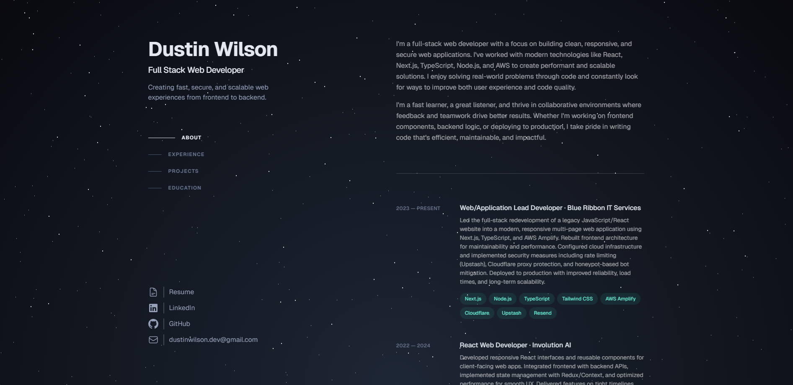

# Dustin Wilson — Personal Portfolio Website

This is my personal portfolio website, built to showcase my web development skills, projects, and experience as a full-stack developer. It serves as a hub for recruiters, hiring managers, and collaborators to learn more about my work.

## ✨ Features

- **Modern Frontend** — Built with Next.js, React, and TypeScript for fast, SEO-friendly pages.  
- **Responsive Design** — Tailwind CSS for a clean, mobile-first UI.  
- **Dynamic Content** — Project pages and blog posts are fetched from a CMS for easy updates.  
- **Contact Form** — Secure form with email notifications, protected against spam.  
- **Optimized Performance** — Lighthouse scores consistently above 95.

## 🛠 Tech Stack

- **Frontend:** Next.js, React, TypeScript, Tailwind CSS  
- **Backend:** Node.js/Express APIs  
- **Infrastructure:** AWS Amplify + CloudFront (CI/CD pipelines, SSL, custom domain)  
- **Other:** GitHub Actions, Docker (for local dev), Resend (email API)

## 📸 Screenshots



## 🚀 Getting Started

Clone the repo and install dependencies:

```bash
git clone https://github.com/dustinwilson-dev/portfolio.git
cd portfolio
npm install
npm run dev
